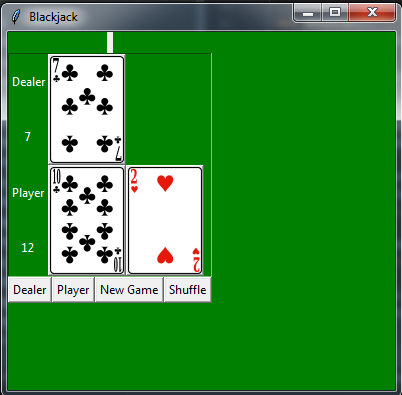
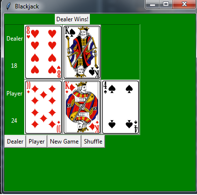

# Blackjack-using-Python

This is a simple blackjack card game which uses Python Tkinter. All the cards are provided in .png format.
RULES:
  Numbered cards are worth the corresponding number indicated on the card. Face cards are worth 10, except for the Ace, which is worth 1  or 11. The most important blackjack rule is simple: beat the dealer's hand without going over 21. If you get 21 points exactly on the deal, that is called a blackjack. The player is dealt two cards initially and the dealer deals himself one card face up and one card face down, so only one card is visible. And the points of cards dealt thereafter decides the winner.
  
INITIAL SCREEN:(EXAMPLE)

  
WINNER SCREEN:(EXAMPLE)

